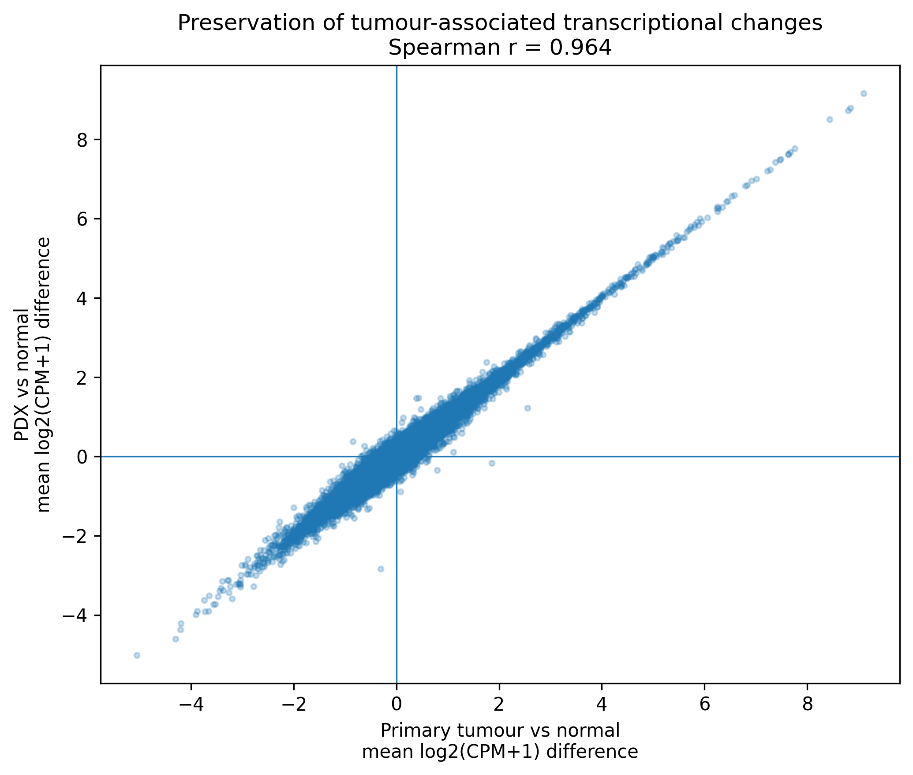
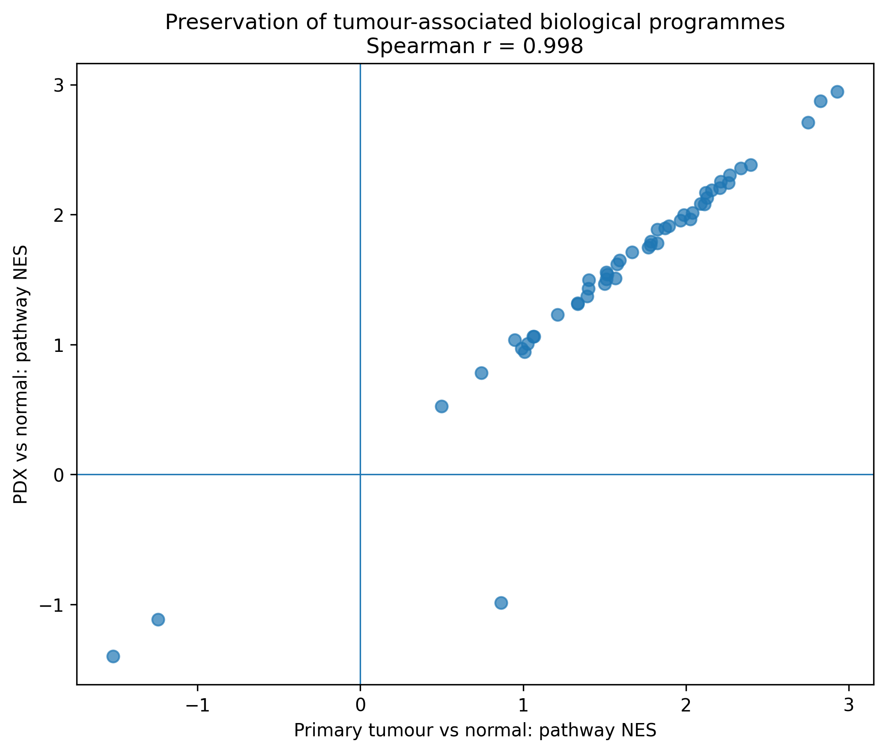

[README.md](https://github.com/user-attachments/files/32600466/README.md)
# Transcriptional Fidelity of Patient-Derived Xenograft Models in Colorectal Signet-Ring Cell Carcinoma

Independent exploratory re-analysis of publicly available bulk RNA-sequencing data from **GSE279979**.

## Question

How faithfully do colorectal signet-ring cell carcinoma (SRCC) patient-derived xenograft (PDX) models preserve the transcriptional state and biological programmes of the primary human tumour?

## Dataset

The public dataset contains:

- 2 adjacent-normal samples
- 2 primary SRCC tumour samples
- 2 SRCC PDX samples

Because of the very small cohort, this analysis is descriptive and hypothesis-generating rather than a definitive validation study.

## Analysis

The workflow included:

- library-size normalization and log-expression transformation
- PCA and transcriptome-wide sample correlation
- primary-tumour and PDX similarity to the normal/tumour centroids
- comparison of tumour-associated gene-expression changes with PDX-associated changes
- Hallmark gene-set enrichment analysis
- direct PDX-versus-primary-tumour pathway analysis
- exploratory Reactome/GO analysis of autophagy-related programmes

## Key results

### Global tumour identity is retained

Both PDX samples showed stronger transcriptome-wide similarity to the primary-tumour centroid:

- PDX 1 → tumour: **r = 0.987**
- PDX 2 → tumour: **r = 0.987**

compared with similarity to adjacent normal tissue (~0.89).

### Tumour-associated expression changes are strongly preserved

Gene-expression changes observed in primary tumour relative to normal tissue were strongly concordant with those observed in PDX:

**Spearman r = 0.964**

### Tumour-associated biological programmes are preserved

Pathway-level Hallmark enrichment showed near-identical tumour and PDX effects:

**Spearman r = 0.998**

Thirty-five significant tumour-associated Hallmark programmes were preserved in PDX.

No significant PDX-acquired Hallmark programme was detected.

Preserved programmes included:

- TNF-alpha / NF-kB signalling
- epithelial–mesenchymal transition
- inflammatory response
- mTORC1 signalling
- E2F targets
- angiogenesis
- hypoxia
- KRAS signalling
- MYC targets
- IL-6/JAK/STAT3 signalling
- glycolysis
- reactive oxygen species response
- p53 signalling
- TGF-beta signalling

## Direct PDX vs primary-tumour comparison

A direct comparison was performed to avoid relying only on two contrasts sharing the same normal reference.

Results:

- **0 significant Hallmark pathways** at FDR < 0.05
- median absolute PDX-vs-tumour expression difference: **0.084 log2(CPM+1)**
- only **8 genes** had an absolute difference >1

These results suggest limited large-scale pathway-level transcriptional remodeling in the PDX samples relative to the primary tumours.

## Autophagy-related biology

Reactome autophagy-related programmes showed similar positive enrichment in primary tumour and PDX.

However, broad autophagy gene sets did not reach FDR < 0.05 in this small cohort, so this should be interpreted as directional concordance rather than independent evidence of significant autophagy activation.

## Interpretation

Within the limitations of the available dataset, SRCC PDX models appear to retain much of the dominant primary-tumour transcriptional state and pathway-level biology.

This supports their use as mechanistic and therapeutic models while emphasizing that transcriptomic fidelity alone does not establish preservation of spatial, stromal, immune or functional tumour properties.

## Limitations

- only two samples per group
- exploratory re-analysis of public data
- PDX models derive directly from tumours, so high similarity is partly expected
- bulk RNA-seq cannot resolve cell-type composition or spatial biology
- shared-normal comparisons can inflate apparent concordance
- transcriptomic similarity does not establish therapeutic validity

## Data source

Public RNA-seq data: **NCBI GEO GSE279979**

No new patient samples were generated as part of this project.
